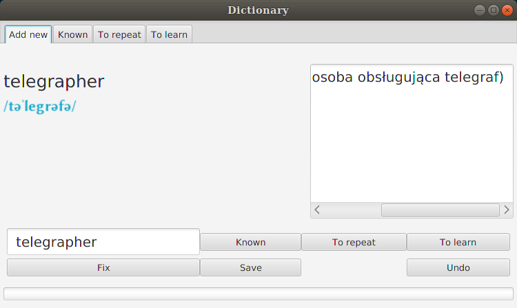
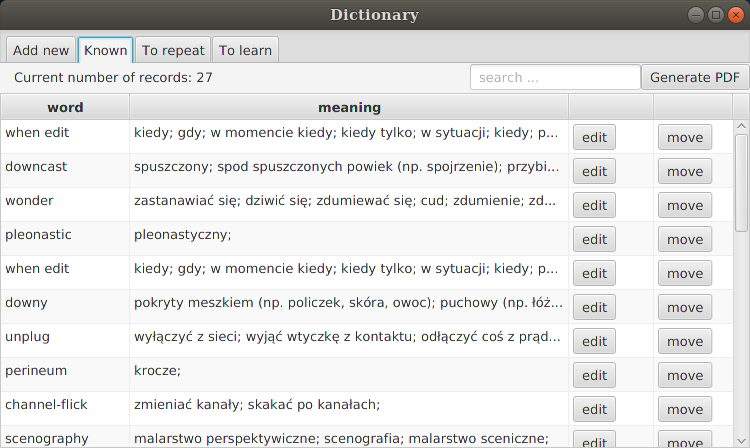
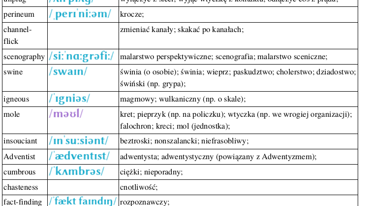
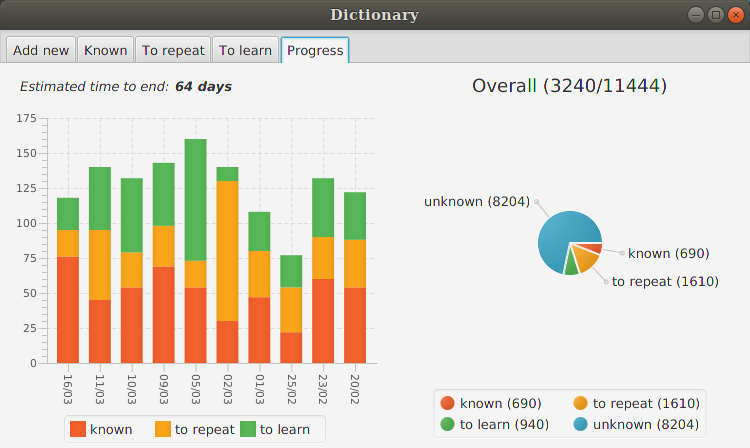

## Table of contents
* [General info](#general-info)
* [Screenshots](#screenshots)
* [Technologies](#technologies)

## General info
Project was realised for my cousin. The main goal of this application is help with division english words into proper categories (known, to repeat, to learn) and generate PDF files with these words.

1. A list of english words is loaded from .txt file.
2. Application downloads pronunciation and meanings for current word from diki.pl dictionary (using __JSoup__).
3. User asigns word to proper catergory (known, to repeat, to learn).
4. At any moment there is possibilty to generate PDF file (using __iText__) with choosen words.
Screenshots below.

## Screenshots

## Technologies
Project is created with:
* Java 10
* JavaFx 11.0
* JSoup 1.12\
library for working with real-world HTML
* iText 5.4\
library for creating and manipulating PDF files
